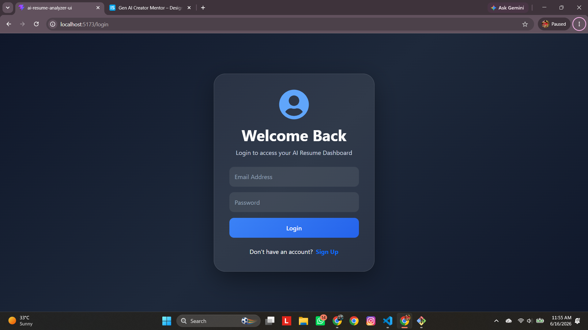
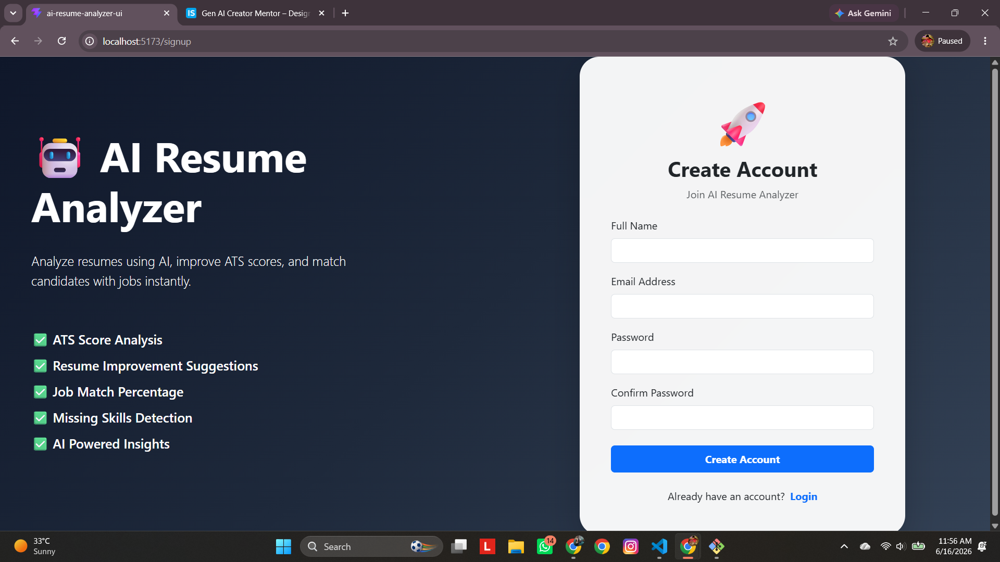
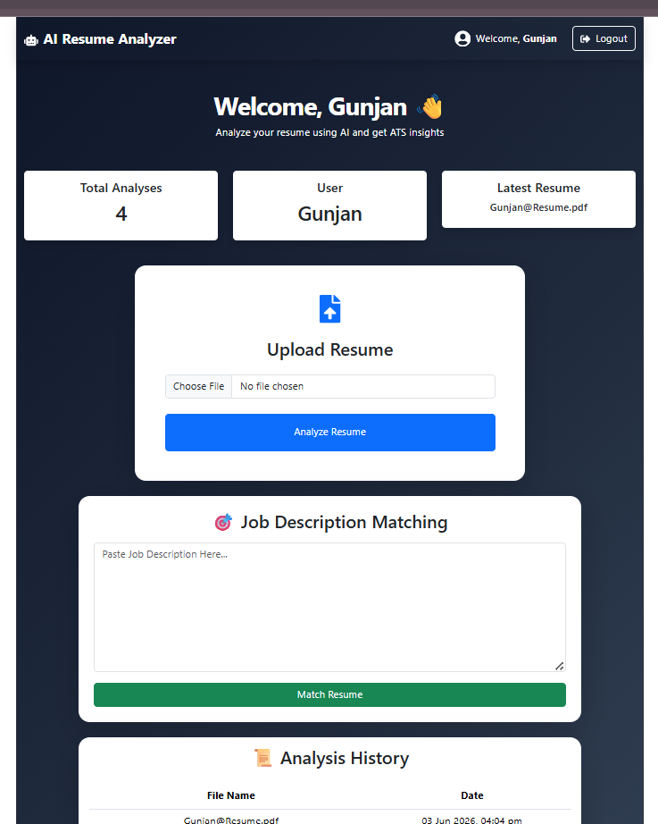

# AI Resume Analyzer & ATS Matcher

An AI-powered Resume Analyzer and ATS Matcher built using React, Spring Boot, MySQL, and Google Gemini AI.

🚀 Live Demo: https://ai-resume-analyzer-beta-five.vercel.app

## Features

* User Registration & Login
* Secure Authentication
* Upload PDF Resumes
* Automatic Resume Text Extraction
* AI-Powered Resume Analysis
* ATS Score Calculation
* Strengths Identification
* Missing Skills Detection
* Personalized Improvement Suggestions
* Resume-to-Job Description Matching
* ATS Match Score Generation
* Missing Keyword Detection
* Resume Analysis History Tracking
* Modern Responsive Dashboard
* Google Gemini AI Integration

## Tech Stack

### Frontend

* React.js
* Vite
* Bootstrap 5
* Axios

### Backend

* Spring Boot
* Java 21
* Spring Data JPA
* REST APIs

### Database

* MySQL

### AI

* Google Gemini 2.5 Flash

## Project Architecture

Resume PDF
↓
Spring Boot Backend
↓
PDF Text Extraction (Apache PDFBox)
↓
Google Gemini AI
↓
Resume Analysis / ATS Matching
↓
MySQL Storage
↓
React Dashboard

## Screenshots

### Login Page



### Signup Page



### Resume Analysis Dashboard



## Getting Started

### Clone Repository

```bash
git clone https://github.com/Gunjankr078/AI-Resume-Analyzer.git
```

### Backend Setup

```bash
cd airesumeanalyzer
./mvnw spring-boot:run
```

### Frontend Setup

```bash
cd ai-resume-analyzer-ui
npm install
npm run dev
```

### Environment Variables

Create an application.properties file:

```properties
spring.datasource.url=YOUR_DATABASE_URL
spring.datasource.username=YOUR_DB_USERNAME
spring.datasource.password=YOUR_DB_PASSWORD

gemini.api.key=YOUR_GEMINI_API_KEY
```

## Future Enhancements

* Export Analysis as PDF
* JWT Authentication
* Cloud Deployment
* Resume Version Comparison
* Advanced ATS Analytics
* Interview Question Generation
* Resume Optimization Suggestions
* LinkedIn Profile Analysis

## Author

Gunjan
